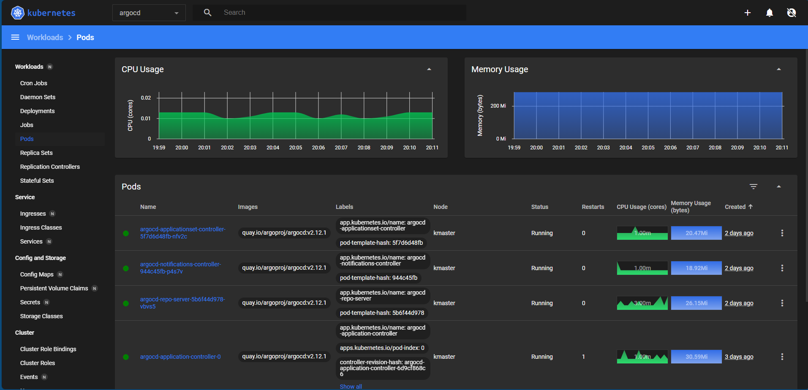
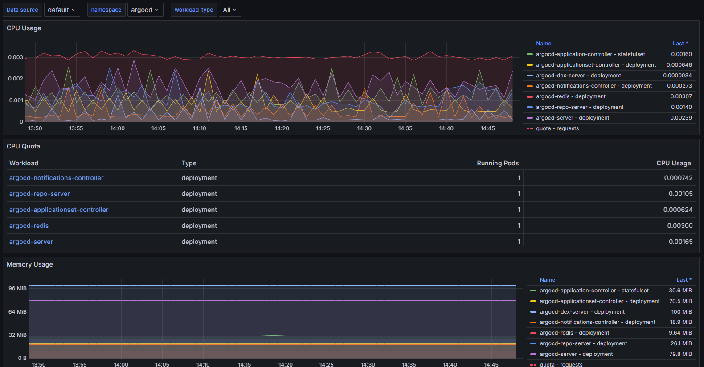
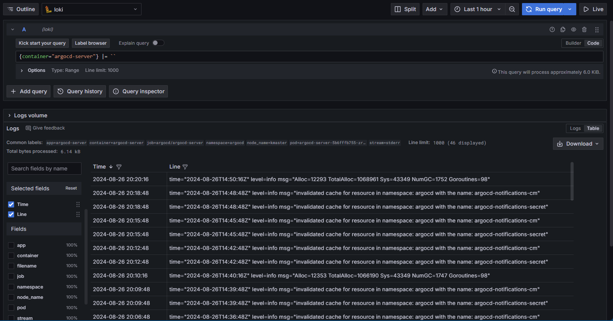
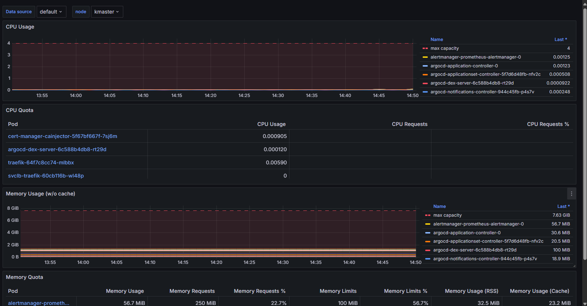
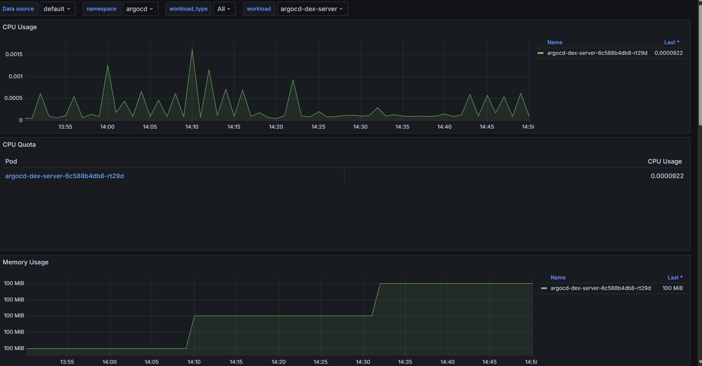

# kubernetes-monitoring

Kubernetes monitoring tracks the health and performance of your cluster and applications. It's essential because it ensures that your infrastructure is running smoothly, identifies issues like resource bottlenecks or failures, and helps optimize application performance. Without monitoring, problems can go unnoticed, leading to potential downtime, degraded performance, and poor user experience.

# Why monitoring is must ?

Kubernetes monitoring is essential today because it enables real-time visibility into the health and performance of complex, dynamic containerized environments. With microservices and distributed systems becoming the norm, monitoring helps detect and resolve issues quickly, ensures efficient resource utilization, and maintains high availability and security. Without effective monitoring, the complexity of Kubernetes environments can lead to undetected problems, costly downtime, and suboptimal performance, making it a critical component for modern DevOps and SRE practices.

# tools used 

## grafana -> for visualization
## prometheus -> metrics database
## node exporter -> metrics scraper
## loki -> logs database
## promtail -> logs scraper

```


```

### alternatively we can use efk stack

````

````


## elasticsearch -> logs database
## fluentd -> logs scraper
## kibana -> logs visualization

```


```


# this guide contains all the yaml and commands to install monitoring stack in any kubernetes cluster here are some visulization that we can get from this monitoring stack


```


```











